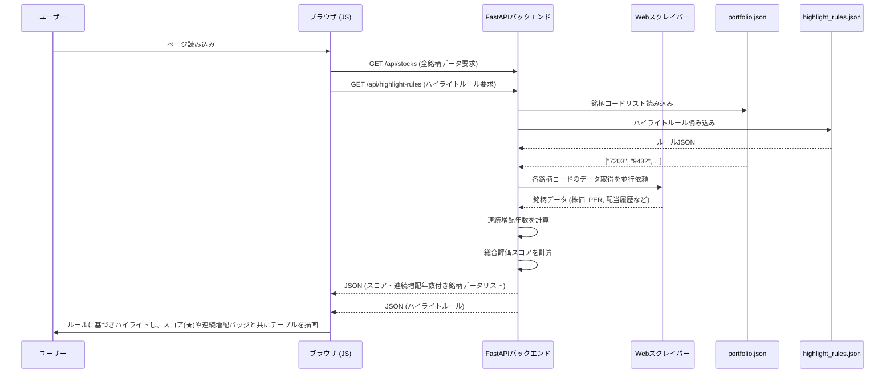
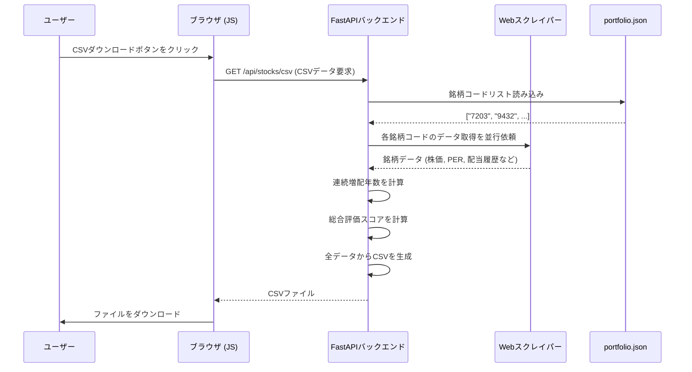

# 国内株式ポートフォリオ管理アプリ (jp-stock-portfolio-app)


## 概要

ユーザーが管理する国内株式の銘柄リストに基づき、株価、財務指標(PER, PBR, ROEなど)、配当履歴をYahoo!ファイナンスから取得し、Webページに一覧表示するシングルページアプリケーション（SPA）です。
各指標が割安か割高かを視覚的に判断するためのサポート機能も搭載しています。

## 主な機能

- **銘柄一覧表示**: 登録された銘柄の各種情報をリアルタイムで取得し、テーブル形式で表示します。
- **指標ハイライト**: PERやPBRなどの指標が、設定ファイル(`highlight_rules.json`)の基準に応じて色付けされ、割安・割高が一目で分かります。
- **総合評価スコア**: 複数の指標（PER, PBR, ROE, 利回り, **連続増配**）を総合的に評価した「スコア」を**最大10点**の星印（★★★★★<br/>★★★★★）で表示し、銘柄の魅力を多角的に判断できます。
- **連続増配分析**: 過去10年間の配当データから**連続増配年数**（配当維持を含む）を自動で計算し、バッジで表示します。詳細な配当履歴はツールチップで確認できます。
- **銘柄追加・削除**: 銘柄コードを指定して、ポートフォリオの銘柄を管理します。
- **ソート機能**: ポートフォリオ一覧の各項目（スコア、連続増配年数など）をクリックすることで、データを昇順・降順に並び替えることができます。
- **外部リンク**: 銘柄名や連続増配バッジをクリックすると、Yahoo!ファイナンスの該当ページを新しいタブで開きます。
- **CSVダウンロード**: 表示しているポートフォリオ全体をCSVファイルとしてダウンロードできます。

## 主な技術

### バックエンド
- **言語**: Python 3.10+
- **Webフレームワーク**: FastAPI
- **Webサーバー**: Uvicorn
- **データ取得**: `requests` (HTMLからページ埋め込みJSONを抽出)
- **データ永続化**: JSONファイル (`portfolio.json`, `highlight_rules.json`)

### フロントエンド
- **HTML/CSS**: Jinja2テンプレート
- **JavaScript**: ES6+, Fetch API, DOM操作

## セットアップと実行方法

1. **リポジトリをクローンします。**
   ```bash
   git clone https://github.com/your-username/jp-stock-portfolio-app.git
   cd jp-stock-portfolio-app
   ```

2. **必要なPythonライブラリをインストールします。**
   ```bash
   pip install fastapi uvicorn python-multipart requests jinja2 beautifulsoup4
   ```

3. **FastAPI開発サーバーを起動します。**
   ```bash
   uvicorn app:app --reload
   ```

4. **ブラウザでアクセスします。**
   Webブラウザを開き、 `http://127.0.0.1:8000` にアクセスしてください。

## 使い方

- **銘柄の追加**: 画面左側の操作パネルにある入力フォームに4桁の銘柄コードを入力し、「追加」ボタンをクリックします。
- **銘柄の削除**: 一覧テーブルの各行にある「削除」ボタンをクリックします。
- **データ更新**: ページをリロードすると、全銘柄の最新情報が再取得されます。
- **ソート**: 一覧テーブルのヘッダー（「総合評価スコア」や「連続増配」など）をクリックすると、その列のデータで昇順・降順にソートされます。
- **詳細情報の確認**: 
    - 「総合評価スコア」の星にマウスカーソルを合わせると、評価の内訳が表示されます。
    - 「連続増配」のバッジにマウスカーソルを合わせると、過去10年間の配当履歴が表示されます。
    - 「連続増配」のバッジをクリックすると、Yahoo!ファイナンスの配当詳細ページが開きます。
- **CSVダウンロード**: 左側の操作パネルにある「CSVをダウンロード」ボタンをクリックすると、表示されているポートフォリオがCSVファイルとして保存されます。
- **ハイライト基準の変更**: `highlight_rules.json` ファイルを編集することで、指標がハイライトされる基準（PERの閾値や連続増配の評価年数など）を自由に変更できます。

## 処理フロー

### データ表示フロー


### CSVダウンロードフロー


(銘柄追加・削除フローは変更なしのため省略)

## 課題 (next step)

### その他の課題/改善事項
1. 銘柄毎にチェックボックスで選択可能な機能の追加。
  - 複数の銘柄を同時削除することができる機能の追加
    - 選択した銘柄に一括で以下の操作が可能になる
      - 削除:「削除した銘柄データは戻りません。本当に消して大丈夫ですか？」という確認メッセージを表示する。その上でOKボタンを押したら削除処理を実行して対象銘柄を一度に削除する。
2. 銘柄の「保有管理区分」の追加と、分析ページの追加
  - 銘柄毎に保有区分をボタンで管理可能にする。保有区分がついた銘柄には「平均購入単価」と「数量」を入力可能になる。
    - また、「平均購入単価」と「数量」を掛けて「投資額」を算出し、これらの項目と「現在株価」を利用して、「評価額」、「損益」、「損益（％）」を算出する
      - 「投資額」:「平均購入単価」*「数量」
      - 「評価額」:「現在株価」*「数量」
      - 「損益」： 「評価額」-「投資額」
      - 「損益（％）」:(「投資額」/「評価額」) - 1.0
  - 上記の情報が入った銘柄に関して、ポートフォリオ分析ページを作成する
    - 保有区分の追加全ての銘柄の「業種」毎に「評価額」の合計値として、「業種別評価額合計」を算出
    - 「業種」と 「業種別評価額合計」から円グラフで業種別の保有比率情報を可視化する
      - 業種別の保有比率情報が一目でわかる為、偏りがないか？を管理することでリバランスの判断情報にする

### memo
テスト用高配当銘柄
7272 ヤマハ発動機(株)
9434 ソフトバンク

---

## 対応済みの課題

### UI改善とエラーハンドリング強化 (2025/11/05 対応済み)
- **対応**:
  - **2カラムレイアウト導入**: 画面を左の操作パネルと右の一覧表示エリアに分割し、一覧性と操作性を向上させた。
  - **エラー表示の強化**:
    - データ取得に失敗した銘柄も、原因（「銘柄が見つかりません」など）と共にテーブル上に赤く表示するように変更。
    - 銘柄追加時に、処理結果（成功・失敗・重複）を画面右上のメッセージで通知する機能を追加。
  - **安定性の向上**: ネットワークエラー発生時に自動で再試行するリトライ処理を導入し、データ取得の成功率を高めた。
  - **開発者向け改善**: バックエンドのログ機能を強化し、エラー発生時の原因調査を容易にした。

### UI改善および評価ロジックの強化 (2025/11/04 対応済み)
- **対応**:
  - **連続増配分析機能**: 過去10年間の配当履歴から連続増配年数を計算し、バッジで表示する機能を追加。詳細な履歴はツールチップで確認可能にした。
  - **総合評価スコア改善**: 評価項目に「連続増配」を追加し、最大10点満点の評価に変更。
  - **UI/UX改善**: 連続増配バッジにYahoo!ファイナンスへの外部リンクを設定。また、スコア表示が長くなりレイアウトが崩れる問題を、星を5個x2行で表示することで修正した。

### 配当履歴表示機能の不具合修正 (2025/11/04 対応済み)
- **原因**: Yahoo!ファイナンスの仕様変更により、従来のHTML解析ロジックでは配当履歴が取得できなくなっていた。
- **対応**: ユーザーからの情報提供により、配当履歴専用ページ (`/dividend`) を発見。このページに埋め込まれているJSONデータ (`__PRELOADED_STATE__`) を解析する方式に `scraper.py` を変更し、安定的なデータ取得を実装。フロントエンドも合わせて修正し、過去数年分の配当履歴を表示できるようにした。

### UI改善：スコア名称の明確化 (2025/11/03 対応済み)
- **対応**: ポートフォリオ一覧に表示されるスコアの名称を、内容が分かりやすい「総合評価スコア」に変更した。

### スコアの可視化と評価不能時の表示改善 (2025/11/02 対応済み)
- **対応**: スコアの星印にマウスオーバーすると、点数の内訳（PER, PBR, ROE, 利回り）がツールチップで表示されるように改善した。また、評価に必要な指標が取得できずスコアが0点になる場合は、スコアを「N/A」と表示し、ツールチップで「評価指標なし」と説明するように変更した。

### 割安度分析機能の追加 (2025/11/01 対応済み)
- **対応**: PERやPBR等の指標が割安・割高かを判断するための「ハイライト機能」と、複数指標を統合した「割安度スコア」機能を追加した。

### CSVダウンロード機能の追加 (2025/11/01 対応済み)
- **対応**: ポートフォリオ一覧をCSVファイルとしてダウンロードする機能を追加した。

### データ取得の不具合修正 (2025/11/01 対応済み)
- **原因**: Yahoo!ファイナンスの仕様変更により、前日比、配当利回り等のデータが取得できなくなっていた。
- **対応**: 新しいデータ構造に合わせて`scraper.py`のデータ解析ロジックを修正した。

### 時価総額が「N/A」になる問題 (2025/11/01 対応済み)
- **原因**: `scraper.py`が参照していたYahoo!ファイナンスの内部APIの仕様が変更され、時価総額のデータ形式が変わっていたため。
- **対応**: 新しいデータ形式に対応するよう、`scraper.py`のデータ解析ロジックを修正した。
