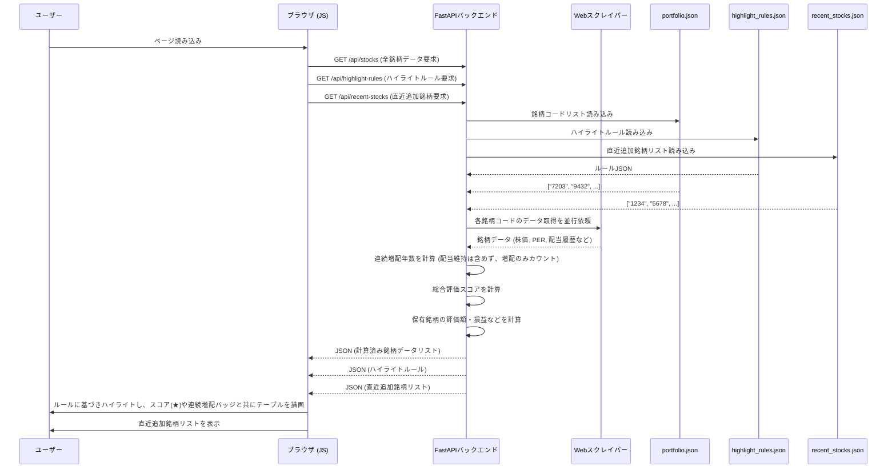
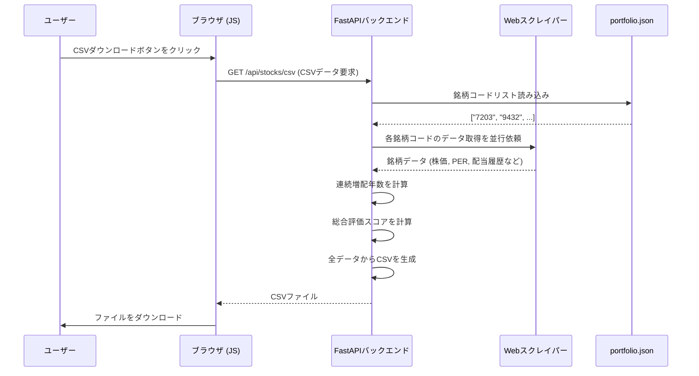
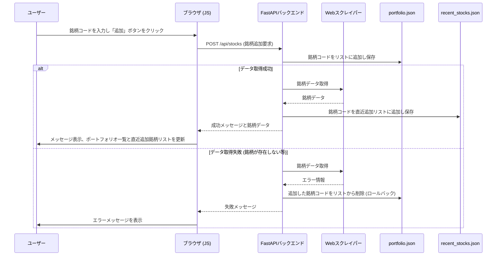

# 国内株式ポートフォリオ管理アプリ (jp-stock-portfolio-app)


## 概要

ユーザーが管理する国内株式、米国株式、投資信託のポートフォリオに基づき、株価や財務指標、配当履歴などをYahoo!ファイナンスから取得し、Webページに一覧表示するシングルページアプリケーション（SPA）です。
各指標が割安か割高かを視覚的に判断するためのサポート機能も搭載しています。

## 主な機能

- **銘柄一覧表示**: 登録された銘柄の各種情報をリアルタイムで取得し、テーブル形式で表示します。
- **決算月表示**: 国内株式・米国株式について、ポートフォリオ一覧に各銘柄の決算月を表示し、権利確定日などの参考情報として活用できます。
- **複数口座対応の保有情報管理**: 1つの銘柄に対して、複数の口座（特定、一般、旧NISA、新NISAなど）での保有情報を個別に管理できます。口座ごとに取得単価と数量を記録し、評価額、損益、損益率、年間配当予想を自動で計算・表示します。
- **ポートフォリオ分析**: 保有銘柄のみを対象とした分析ページで、ポートフォリオ全体のサマリー、保有口座ごとの詳細一覧、業種別および口座種別ごとの保有比率を円グラフで視覚的に確認できます。このページの保有銘柄一覧は、各項目でのソートに加え、銘柄コード/銘柄名でのテキスト検索、業種別・口座種別でのドロップダウンフィルタを組み合わせた柔軟な絞り込みが可能です。さらに、プライバシー保護のため、ページ上のすべての金額表示（評価額、損益など）をワンクリックで隠す「目隠し機能」も備えています。
- **指標ハイライト**: PERやPBRなどの指標が、設定ファイル(`highlight_rules.json`)の基準に応じて色付けされ、割安・割高が一目で分かります。
- **総合評価スコア**: 複数の指標（PER, PBR, ROE, 利回り, **連続増配**）を総合的に評価した「スコア」を**最大10点**の星印（★★★★★<br/>★★★★★）で表示し、銘柄の魅力を多角的に判断できます。
- **連続増配分析**: 過去10年間の配当データから**連続増配年数**（前期比で増配している年数）を自動で計算し、バッジで表示します。詳細な配当履歴はツールチップで確認できます。
- **銘柄追加・削除**: 銘柄コードを指定して、ポートフォリオの銘柄を管理します。複数銘柄の一括削除、および直近追加した銘柄10件のリスト表示・入力補助機能も搭載しています。
- **ソート機能**: ポートフォリオ一覧および分析ページの保有銘柄一覧の各項目をクリックすることで、データを昇順・降順に並び替えることができます。銘柄コードや銘柄名でのリアルタイムフィルタリング機能も利用可能です。
- **外部リンク**: 銘柄名や連続増配バッジをクリックすると、Yahoo!ファイナンスの該当ページを新しいタブで開きます。
- **CSVダウンロード**: 表示しているポートフォリオ全体や、分析ページの保有銘柄一覧をCSVファイルとしてダウンロードできます。
- **フロントエンドキャッシュ**: APIから取得した資産データをブラウザにキャッシュし、再読み込み時の表示を高速化します。まずキャッシュデータを表示し、その後バックグラウンドで最新情報を取得して更新します。

## 詳細な機能一覧

### 1. ポートフォリオ管理機能
- **資産の追加**
    - 国内株式、米国株式、投資信託を銘柄コード、ティッカー、ファンドコードでポートフォリオに追加する。
    - コードの形式から資産タイプ（国内株/米国株/投資信託）を自動で判別する。
- **資産の削除**
    - ポートフォリオから特定の資産を選択して一括で削除する。
- **資産情報表示**
    - 資産タイプごとにタブで表示を切り替える。
    - 各資産の最新情報を一覧で表示する（株価、前日比、時価総額など）。
    - 一覧の各項目でソート（並び替え）が可能。
    - 銘柄コードや名称で表示内容をフィルタリングする。
- **保有状況の管理**
    - 資産ごとに、複数の口座（特定口座, 一般口座, 新NISA, 旧NISA）の保有情報を登録・更新・削除できる。
    - 保有情報には「取得単価」と「数量」を記録する。
- **データ更新**
    - 「全件更新」ボタンで、ポートフォリオ内の全資産の情報を最新化する（クールダウン機能付き）。
- **CSVエクスポート**
    - 現在表示しているポートフォリオの一覧をCSVファイルとしてダウンロードする。

### 2. ポートフォリオ分析機能
- **サマリー表示**
    - ポートフォリオ全体の評価額、投資額、損益、損益率、年間配当合計などを表示する。
    - 金額表示のON/OFFを切り替えることができる。
- **グラフ表示**
    - 保有資産の構成比を円グラフで可視化する。
    - 「業種別」「口座種別」「国別」での表示切り替えが可能。
- **保有銘柄一覧**
    - 全ての保有資産の詳細な情報を一覧で表示する（評価額、損益、損益率など）。
    - 銘柄名、業種、口座種別でフィルタリングが可能。
- **分析結果のCSVエクスポート**
    - 保有銘柄一覧をCSVファイルとしてダウンロードする。

### 3. データ取得・加工機能
- **スクレイピング**
    - Yahoo!ファイナンスから以下の情報を取得する。
        - **国内株式**: 株価、企業情報（業種、決算月）、財務指標（PER, PBR, ROE, EPS）、配当情報（利回り, 過去配当履歴）。
        - **米国株式**: 株価、市場情報、財務指標（PER, EPS）、決算月。
        - **投資信託**: 基準価額、純資産総額、信託報酬。
        - **為替レート**: USD/JPYレート。
- **スコアリング（国内株式のみ）**
    - PER, PBR, ROE, 配当利回り, 連続増配年数などの指標に基づき、独自の評価スコアを算出する。
    - スコアの計算ロジックは `highlight_rules.json` で設定可能。
- **データキャッシュ**
    - 取得した外部データを一定時間キャッシュし、APIへの過度なアクセスを防ぐ。

### 4. その他
- **最近追加した資産**
    - メインページで最近追加した資産のコードを一覧表示し、クリックで簡単に追加できる。
- **レスポンシブデザイン**
    - PC画面での閲覧に最適化されている。

## 主な技術

### バックエンド
- **言語**: Python 3.10+
- **Webフレームワーク**: FastAPI
- **Webサーバー**: Uvicorn
- **データ取得**: `requests`, `BeautifulSoup4` (HTMLおよびページ埋め込みJSONの解析)
- **データ永続化**: JSONファイル (`portfolio.json`, `highlight_rules.json`)

### フロントエンド
- **HTML/CSS**: Jinja2テンプレート
- **JavaScript**: ES6+, Fetch API, DOM操作
- **グラフ描画**: Chart.js

## セットアップと実行方法

1. **リポジトリをクローンします。**
   ```bash
   git clone https://github.com/your-username/jp-stock-portfolio-app.git
   cd jp-stock-portfolio-app
   ```

2. **必要なPythonライブラリをインストールします。**
   ```bash
   pip install fastapi uvicorn python-multipart requests jinja2 beautifulsoup4 cachetools
   ```

3. **FastAPI開発サーバーを起動します。**
   ```bash
   uvicorn app:app --reload
   ```

4. **ブラウザでアクセスします。**
   Webブラウザを開き、 `http://127.0.0.1:8000` にアクセスしてください。 `http://127.0.0.1:8000/analysis` で分析ページにアクセスできます。

## 使い方

- **銘柄の追加**: 画面左側の操作パネルにある入力フォームに4桁の銘柄コードを入力し、「追加」ボタンをクリックします。
- **保有情報の管理**: 一覧の「管理」ボタンから、銘柄の取得単価と数量を登録・更新できます。
- **ポートフォリオ分析**: サイドバーの「ポートフォリオ分析ページへ」リンクから、保有銘柄に特化した分析ページへ移動できます。
- **銘柄の削除**: 一覧テーブルの各行にある「削除」ボタンをクリックします。
- **データ更新**: ページをリロードすると、まずキャッシュされたデータが即座に表示され、その後バックグラウンドで全銘柄の最新情報が自動的に再取得・更新されます。手動で即時更新したい場合は、サイドバーの「全件更新」ボタンを使用します。
- **ソート**: 一覧テーブルのヘッダー（「総合評価スコア」や「連続増配」など）をクリックすると、その列のデータで昇順・降順にソートされます。
- **詳細情報の確認**: 
    - 「総合評価スコア」の星にマウスカーソルを合わせると、評価の内訳が表示されます。
    - 「連続増配」のバッジにマウスカーソルを合わせると、過去10年間の配当履歴が表示されます。
    - 「連続増配」のバッジをクリックすると、Yahoo!ファイナンスの配当詳細ページが開きます。
- **CSVダウンロード**: 左側の操作パネルにある「CSVをダウンロード」ボタンをクリックすると、表示されているポートフォリオがCSVファイルとして保存されます。
- **ハイライト基準の変更**: `highlight_rules.json` ファイルを編集することで、指標がハイライトされる基準（PERの閾値や連続増配の評価年数など）を自由に変更できます。

## 処理フロー

### データ表示フロー


### CSVダウンロードフロー


### 銘柄追加フロー


## 課題 (next step)

主要な機能は実装完了しましたが、継続的な改善と機能追加を検討しています。
- **サイトアクセス量を減らす為に全件更新の連続ボタン押しの対応の調整**: 現状仕様が曖昧な為、整理して対応方法を決める必要あり。
- **パフォーマンス改善**: 登録銘柄数が数百件規模に増えた場合にも、軽快な動作を維持するための改善。
    - **バックエンド**:
        - **永続キャッシュの導入**: Redis等を導入してサーバー再起動後もキャッシュを維持し、データ取得時間を短縮。
        - **リクエスト数の制御**: `asyncio.Semaphore`などを利用し、外部APIへの同時リクエスト数を制限して安定性を向上。
    - **フロントエンド**:
        - **APIのページネーション対応**: 全件取得APIをページネーション化し、初期読み込みデータ量を削減。
        - **仮想スクロールの実装**: 大量データのテーブル表示において、画面表示領域のみを描画することで、ブラウザのレンダリング負荷を軽減。
- **UI/UXのさらなる向上**: ユーザーからのフィードバックに基づく継続的な改善。
- **テストコードの拡充**: より安定したアプリケーションのための単体テスト・結合テストの追加。


---
### 現在の課題 (2025/12/02 時点)

---

## 対応済みの課題

### 時価総額表示の安定化 (2026/01/04 対応)
- **原因**: 夜間など特定の時間帯に、Yahoo!ファイナンスから返される国内株式の時価総額データの形式が、通常の文字列形式から辞書形式へと変更されることが原因で、データが取得できず「N/A」と表示されていました。
- **対応**: `scraper.py` の国内株式データ取得ロジックを修正。時価総額のデータが文字列形式でも辞書形式でも、両方に対応できるよう堅牢化し、時間帯に依存せず安定して表示できるようにしました。

### 年間配当の税金計算機能の追加 (2025/12/31 対応)
- **対応**: ポートフォリオ分析ページにおいて、年間配当の税引き後（手取り）金額を表示する機能を追加しました。
  - `tax_config.json` ファイルを新設し、国内株式や米国株式などの資産タイプに応じた税率を外部から設定可能にしました。
  - NISA口座などの非課税口座と、特定口座などの課税口座を自動で判別し、課税口座の配当金にのみ税率を適用して税引き後金額を計算します。
  - 分析ページのサマリーと保有銘柄一覧の両方で、税引き前と税引き後の年間配当額を確認できます。

### ポートフォリオ一覧のフィルタ機能強化 (2025/12/27 対応)
- **対応**: ポートフォリオ一覧ページに「保有銘柄のみ表示」フィルタを追加しました。これにより、ユーザーは実際に保有している銘柄のみを一覧に表示し、評価スコアや前日比などでソート・比較することが可能になりました。(#27)

### 決算月表示機能の追加 (2025/12/23 対応)
- **対応**: 国内株式・米国株式について、それぞれの決算月をYahoo!ファイナンスから取得し、ポートフォリオ一覧に表示する機能を追加しました。データソースとして、ページに埋め込まれたJSONデータを解析する方式を採用し、安定した情報取得を実現しています。

### 指標ハイライト機能の不具合とデグレの修正 (2025/12/10 対応)
- **原因**: Yahoo!ファイナンスのデータ構造が一部変更され、特定の指標（PERなど）がオブジェクト形式と文字列形式の両方で返されるようになった。この不整合に `scraper.py` が対応できず、メインページでの指標ハイライト機能が停止。また、このエラーが原因で、分析ページのAPIでサーバーエラー（500）が発生するデグレも引き起こしていた。
- **対応**: `scraper.py` のデータ取得ヘルパー関数を、オブジェクトと文字列の両方のデータ形式を正しく処理できるように修正。これにより、指標ハイライト機能が復旧し、同時に分析ページのデグレも解消された。

### 資産追加時の通知機能の修正 (2025/12/08 対応)
- **原因**: 資産追加APIが成功時に返すJSONに、フロントエンドが通知表示に必要とする`message`キーが含まれていなかった。
- **対応**: `app.py`を修正し、APIの成功レスポンスにメッセージを含めることで、資産追加時に画面右上で成功通知が正しく表示されるようにした。

### UI改善とバックエンド修正 (2025/12/04 対応)
- **ポートフォリオ一覧のUI修正**:
  - ユーザーの要望に基づき、国内株式一覧テーブルから「市場」の列を削除し、表示をシンプルにしました。
- **分析ページのCSV出力修正**:
  - 分析ページからダウンロードされるCSVファイルに不要な「市場」データが含まれていた問題を修正しました。
- **CSVダウンロード機能の不具合修正**:
  - ポートフォリオ一覧ページのCSVダウンロード機能が、FastAPIのルーティング順序の問題で動作していなかった不具合を修正しました。APIエンドポイントの定義順序を調整し、正常に機能するようにしました。

### バックエンドキャッシュの修正 (2025/12/02 対応)
- `scraper.py`の`get_scraper`関数が毎回新しいスクレイパーインスタンスを生成していたため、キャッシュが機能していなかった問題を修正。これにより、セッション中の不要なスクレイピングを抑制。

### ポートフォリオ分析ページの年間配当表示の復旧 (2025/12/02 対応)
- `templates/analysis.html`に年間配当のテーブルヘッダーを追加。
- `static/js/analysis.js`で`item.estimated_annual_dividend`を参照するように修正し、年間配当合計もサマリーに表示されるように修正。
- `app.py`の`display_keys_to_convert`に`"estimated_annual_dividend"`を追加。
- `scraper.py`が会社予想の年間配当を正しく取得できていなかった問題を修正。
- 年間配当のソートが機能していなかった問題を、`templates/analysis.html`の`data-key`を`"estimated_annual_dividend"`に修正することで解決。

### ポートフォリオ分析ページの「市場」項目を非表示化 (2025/12/02 対応)
- ユーザーの要望により、`templates/analysis.html`から「市場」の`<th>`要素を削除し、`static/js/analysis.js`から関連する`createCell`呼び出しを削除。
- 不要になったCSSセレクタも削除。

### ポートフォリオ分析ページの損益率の色付け修正 (2025/12/02 対応)
- 損益率の文字色だけでなく背景色も変更し、メインページのPERなどと同様の薄い緑/赤の背景色になるように`static/css/style.css`の`profit`と`loss`クラスを定義し、`static/js/analysis.js`でこれらのクラスを適用するように修正。

### ポートフォリオ分析ページの「金額を隠す」機能の復旧と拡張 (2025/12/02 対応)
- `static/css/style.css`に`masked-amount`クラスの定義を追加し、機能が動作するように復旧。
- 数量、取得単価、年間配当、およびグラフのツールチップの金額も隠せるように機能を拡張。

### ポートフォリオ分析ページのポートフォリオ構成グラフ表示の復旧 (2025/12/02 対応)
- `static/js/analysis.js`のグラフ描画ロジックを修正し、`templates/analysis.html`の`<canvas>`要素を正しく参照するように変更。

### 米国株式の時価総額表示の修正 (2025/12/02 対応)
- `static/js/main.js`の`renderUSTable`関数内の`item`参照エラーを`usStock`に修正し、米国株式の情報が表示されない問題を解決。
- 時価総額が正しく表示されるように修正。

### フロントエンドキャッシュとUI改善 (2025/11/30 対応)
- **フロントエンドキャッシュの実装**:
  - APIから取得した資産データをブラウザの`localStorage`にキャッシュするように変更。ページ再読み込み時に、まずキャッシュされたデータを表示することで、体感速度を向上させた。
  - データの追加・更新・削除時にはキャッシュも同期して更新し、整合性を維持。
- **「全件更新」ボタンのクールダウン機能**:
  - 「全件更新」ボタンに10分間のクールダウンを導入し、短時間での連続的なAPIリクエストを防止。クールダウン中はボタンが無効化され、残り時間が表示されるようにした。

### 分析ページの表示改善と安定性向上 (2025/11/27 対応)
- **業種情報の追加**: 分析ページの「保有銘柄一覧」に「業種」列を追加し、各銘柄の業種を確認できるように改善。
- **データ処理の安定化**: 分析データ生成時の計算ロジックを改善。現在値などが取得・変換できない場合でも、その銘柄がリストから除外されることなく、該当項目が「N/A」と表示されるように修正し、安定性を向上させた。

### 投資信託対応とUI改善 (2025/11/25 対応)
- **投資信託のデータ取得機能の安定化**:
  - データ取得方法を、HTML解析からページ埋め込みJSON (`__PRELOADED_STATE__`) の解析に切り替え、基準価額、純資産総額、信託報酬などの主要な情報を安定的に取得できるように修正。
  - 前日比のパーセンテージ表示で括弧が二重になる不具合を修正。
- **保有数量の小数点対応**:
  - 投資信託の保有数量について、管理画面での小数点以下の入力および表示に対応。
  - 分析ページの保有銘柄一覧でも小数点以下の数量を表示するように修正。
- **UIの視認性向上**:
  - サイドバーの「全件更新」ボタンが背景に埋もれて見えにくかった問題を解消し、青系の目立つデザインに変更。

### 分析ページの機能強化とプライバシー保護 (2025/11/19 対応)
- **対応**:
  - **複合フィルタ機能の追加**: 分析ページの「保有銘柄一覧」に、従来のテキストフィルタ（銘柄コード/銘柄名）に加え、「業種」と「口座種別」で絞り込むためのドロップダウンフィルタを追加。複数の条件を組み合わせて、より詳細な分析が可能になった。
  - **金額表示の目隠し機能**: 分析ページに「金額を隠す」チェックボックスを設置。プライバシー保護のため、チェックを入れるとサマリー、テーブル、グラフ内のすべての金額関連情報が「***」でマスクされるようにした。

### 分析ページの機能改善 (2025/11/19 対応)
- **対応**:
  - **ソート機能の追加**: 分析ページの「保有銘柄一覧」テーブルに、メインページと同様の列ごとのソート機能を追加。`main.js`のロジックを参考に`analysis.js`を修正し、クリックされたヘッダーに応じてデータを昇順・降順に並び替えられるようにした。
  - **グラフ表示の改善**: 業種別ポートフォリオなどで円グラフが小さく表示される問題を改善するため、CSSを調整してグラフ表示エリアの横幅を広げ、視認性を向上させた。

### 分析ページのテーブル表示バグ修正 (2025/11/18 対応)
- **原因**: CSSの`position: sticky`（追従ヘッダー）が、カードヘッダーとテーブルヘッダーで二重に設定（入れ子状態）されていたため、ブラウザのレンダリングに不具合が発生し、テーブルの2行目がヘッダーに重なって表示されていた。
- **対応**: カードヘッダーの`sticky`指定を解除し、テーブルヘッダー(`thead`)のみが追従するようにCSSを修正。`sticky`の複雑な入れ子構造を解消し、表示を正常化した。

### ポートフォリオ分析ページのUI/UX改善 (2025/11/13 対応)
- **対応**:
  - **2カラムレイアウト導入**: 視認性向上のため、サマリー/グラフ（左カラム）と保有銘柄一覧（右カラム）を分割する2カラムレイアウトを導入。
  - **円グラフの視認性改善**: 業種が多数表示された際の視認性を改善するため、円グラフのカラーパレットをより多くの色を含むものに更新。
  - **UI調整**: 利便性向上のため、保有銘柄一覧のCSVダウンロードボタンをテーブル上部に移動し、デザインを調整。
  - **その他**: ユーザー個別の設定ファイルである `recent_stocks.json` を `.gitignore` に追加し、リポジトリの管理対象から除外。

### データキャッシュの導入 (2025/11/12 対応済み)
- **対応**: `scraper.py`に`cachetools`ライブラリを導入し、Yahoo!ファイナンスからのデータ取得結果を1時間キャッシュするようにした。これにより、APIへのアクセス負荷を軽減。

### フロントエンドの差分更新と手動更新機能 (2025/11/12 対応済み)
- **対応**: 銘柄の追加、削除、保有情報の更新時にページ全体を再読み込みするのではなく、JavaScriptで必要な部分のみを動的に更新するように変更。また、UIに「全件更新」ボタンを追加し、ユーザーが手動で全データをリフレッシュできるようにした。

### 前日比のソートを比率に変更 (2025/11/12 対応済み)
- **対応**: ポートフォリオ一覧の「前日比」列のソートを、金額ではなく前日比率で行うように変更した。

### 複数口座対応の保有管理機能と分析ページの強化 (2025/11/10 対応済み)
- **対応**:
  - **データ構造の再設計**: 1つの銘柄に対して複数の口座（特定、一般、旧NISA、新NISAなど）での保有情報を個別に管理できるようデータ構造を根本的に再設計。既存の単一保有情報から複数口座形式への自動データ移行ロジックを実装。
  - **保有管理APIの整備**: 個別の保有口座情報（追加・更新・削除）を操作するためのAPIを実装。利用可能な口座種別リストを返すAPIも追加。
  - **保有管理UIの刷新**: メインページから開くモーダルで、各銘柄の保有口座情報を一覧表示し、追加・編集・削除が可能に。
  - **分析ページの強化**: 保有口座ごとに詳細な情報（評価額、損益など）を表示するようテーブルを再設計。業種別および口座種別ごとの評価額構成比を円グラフで可視化。
  - **CSVダウンロードの更新**: 分析ページの新しいテーブル構造に合わせたCSVダウンロード機能を更新。

### ソート機能の不具合修正 (2025/11/10 対応済み)
- **原因**: JavaScriptのイベントリスナー内で存在しない関数を呼び出していたため、ソート機能が動作していなかった。
- **対応**: `main.js`内の誤った関数呼び出しを修正し、フィルタリング機能と連携してテーブルのソートが正しく実行されるようにした。

### UI改善とエラーハンドリング強化 (2025/11/05 対応済み)
- **対応**:
  - **2カラムレイアウト導入**: 画面を左の操作パネルと右の一覧表示エリアに分割し、一覧性と操作性を向上させた。
  - **エラー表示の強化**:
    - データ取得に失敗した銘柄も、原因（「銘柄が見つかりません」など）と共にテーブル上に赤く表示するように変更。
    - 銘柄追加時に、処理結果（成功・失敗・重複）を画面右上のメッセージで通知する機能を追加。
  - **安定性の向上**: ネットワークエラー発生時に自動で再試行するリトライ処理を導入し、データ取得の成功率を高めた。
  - **開発者向け改善**: バックエンドのログ機能を強化し、エラー発生時の原因調査を容易にした。

### UI改善および評価ロジックの強化 (2025/11/04 対応済み)
- **対応**:
  - **連続増配分析機能**: 過去10年間の配当履歴から連続増配年数を計算し、バッジで表示する機能を追加。詳細な履歴はツールチップで確認可能にした。
  - **総合評価スコア改善**: 評価項目に「連続増配」を追加し、最大10点満点の評価に変更。
  - **UI/UX改善**: 連続増配バッジにYahoo!ファイナンスへの外部リンクを設定。また、スコア表示が長くなりレイアウトが崩れる問題を、星を5個x2行で表示することで修正した。

### 配当履歴表示機能の不具合修正 (2025/11/04 対応済み)
- **原因**: Yahoo!ファイナンスの仕様変更により、従来のHTML解析ロジックでは配当履歴が取得できなくなっていた。
- **対応**: ユーザーからの情報提供により、配当履歴専用ページ (`/dividend`) を発見。このページに埋め込まれているJSONデータ (`__PRELOADED_STATE__`) を解析する方式に `scraper.py` を変更し、安定的なデータ取得を実装。フロントエンドも合わせて修正し、過去数年分の配当履歴を表示できるようにした。

### UI改善：スコア名称の明確化 (2025/11/03 対応済み)
- **対応**: ポートフォリオ一覧に表示されるスコアの名称を、内容が分かりやすい「総合評価スコア」に変更した。

### スコアの可視化と評価不能時の表示改善 (2025/11/02 対応済み)
- **対応**: スコアの星印にマウスオーバーすると、点数の内訳（PER, PBR, ROE, 利回り）がツールチップで表示されるように改善した。また、評価に必要な指標が取得できずスコアが0点になる場合は、スコアを「N/A」と表示し、ツールチップで「評価指標なし」と説明するように変更した。

### 割安度分析機能の追加 (2025/11/01 対応済み)
- **対応**: PERやPBR等の指標が割安・割高かを判断するための「ハイライト機能」と、複数指標を統合した「割安度スコア」機能を追加した。

### CSVダウンロード機能の追加 (2025/11/01 対応済み)
- **対応**: ポートフォリオ一覧をCSVファイルとしてダウンロードする機能を追加した。

### データ取得の不具合修正 (2025/11/01 対応済み)
- **原因**: Yahoo!ファイナンスの仕様変更により、前日比、配当利回り等のデータが取得できなくなっていた。
- **対応**: 新しいデータ構造に合わせて`scraper.py`のデータ解析ロジックを修正した。

### 時価総額が「N/A」になる問題 (2025/11/01 対応済み)
- **原因**: `scraper.py`が参照していたYahoo!ファイナンスの内部APIの仕様が変更され、時価総額のデータ形式が変わっていたため。
- **対応**: 新しいデータ形式に対応するよう、`scraper.py`のデータ解析ロジックを修正した。