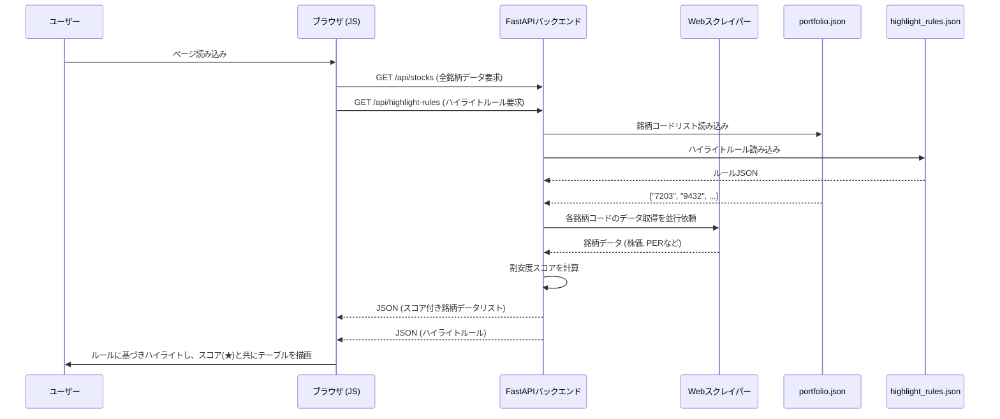
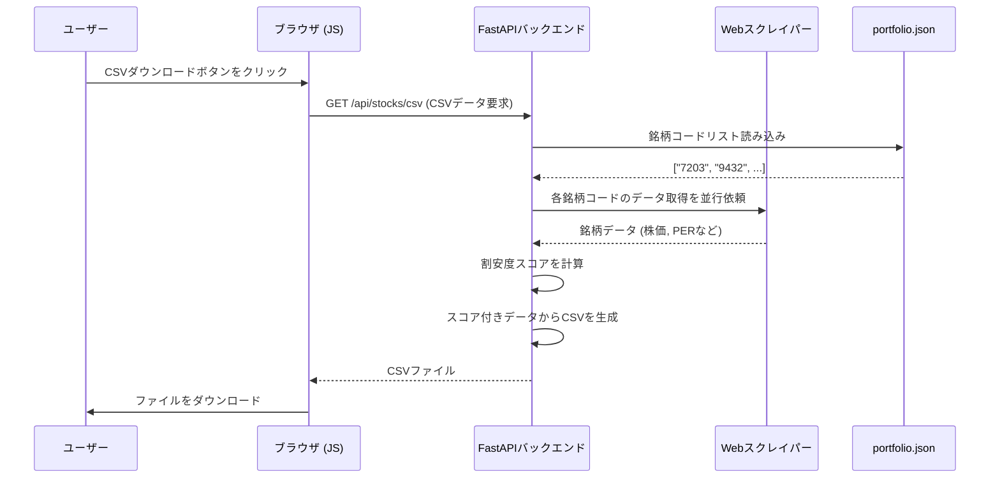
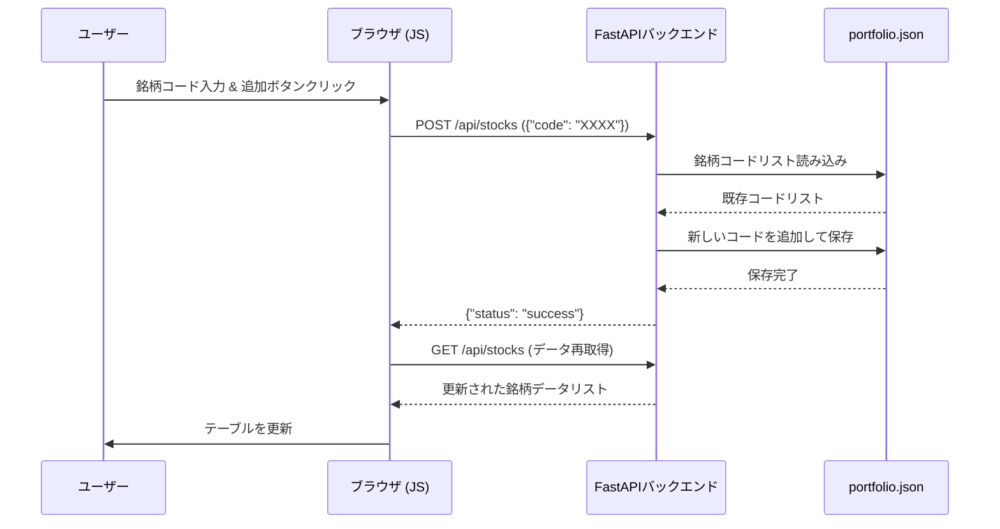
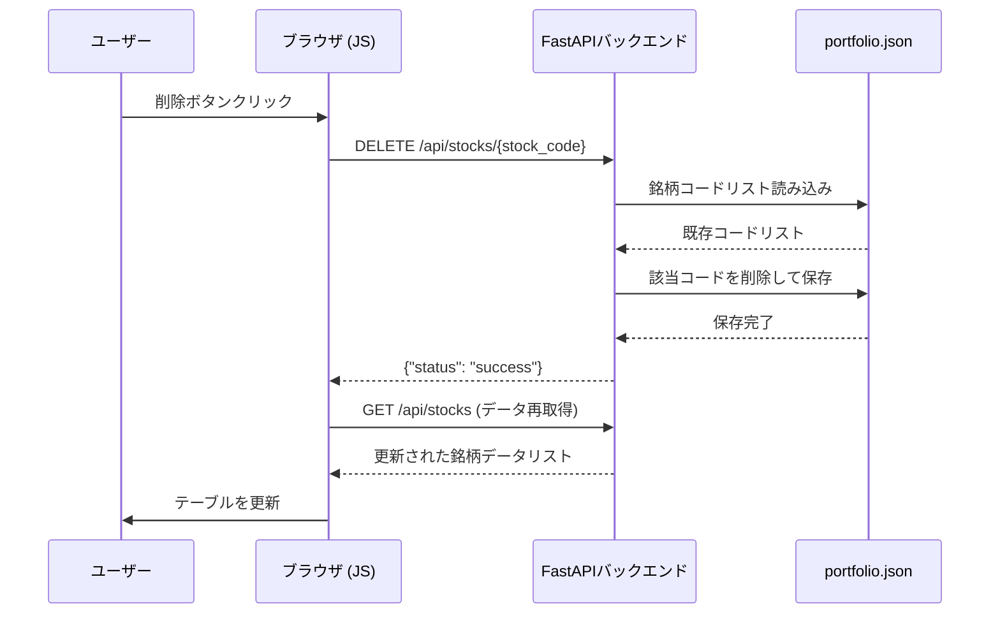

# 国内株式ポートフォリオ管理アプリ (jp-stock-portfolio-app)

## 概要

ユーザーが管理する国内株式の銘柄リストに基づき、株価、財務指標(PER, PBR, ROE, EPSなど)をYahoo!ファイナンスから取得し、Webページに一覧表示するシングルページアプリケーション（SPA）です。
各指標が割安か割高かを視覚的に判断するためのサポート機能も搭載しています。

主な機能は以下の通りです。
- **銘柄一覧表示**: 登録された銘柄の各種情報をリアルタイムで取得し、テーブル形式で表示します。
- **指標ハイライト**: PERやPBRなどの指標が、設定ファイル(`highlight_rules.json`)の基準に応じて色付けされ、割安・割高が一目で分かります。
- **割安度スコア**: 複数の指標を総合的に評価した「スコア」を星印で表示し、銘柄の魅力を多角的に判断できます。
- **銘柄追加・削除**: 銘柄コードを指定して、ポートフォリオの銘柄を管理します。
- **ソート機能**: ポートフォリオ一覧の各項目（株価、スコアなど）をクリックすることで、データを昇順・降順に並び替えることができます。
- **CSVダウンロード**: 表示しているポートフォリオ全体をCSVファイルとしてダウンロードできます。

## 主な技術

### バックエンド
- **言語**: Python 3.10+
- **Webフレームワーク**: FastAPI
- **Webサーバー**: Uvicorn
- **データ取得**: `requests` (HTMLからページ埋め込みJSONを抽出)
- **データ永続化**: JSONファイル (`portfolio.json`, `highlight_rules.json`)

### フロントエンド
- **HTML/CSS**: Jinja2テンプレート
- **JavaScript**: ES6+, Fetch API

## セットアップと実行方法

1. **リポジトリをクローンします。**
   ```bash
   git clone https://github.com/your-username/jp-stock-portfolio-app.git
   cd jp-stock-portfolio-app
   ```

2. **必要なPythonライブラリをインストールします。**
   ```bash
   pip install fastapi uvicorn python-multipart requests jinja2
   ```

3. **FastAPI開発サーバーを起動します。**
   ```bash
   uvicorn app:app --reload
   ```
   `--reload`オプションにより、コードを変更するとサーバーが自動的に再起動します。

4. **ブラウザでアクセスします。**
   Webブラウザを開き、 `http://127.0.0.1:8000` にアクセスしてください。

## 使い方

- **銘柄の追加**: 画面上部の入力フォームに4桁の銘柄コードを入力し、「追加」ボタンをクリックします。
- **銘柄の削除**: 一覧テーブルの各行にある「削除」ボタンをクリックします。
- **データ更新**: ページをリロードすると、全銘柄の最新情報が再取得されます。
- **ソート**: 一覧テーブルのヘッダー（「スコア」や「現在株価」など）をクリックすると、その列のデータで昇順・降順にソートされます。
- **CSVダウンロード**: 「CSVをダウンロード」ボタンをクリックすると、表示されているポートフォリオがCSVファイルとして保存されます。
- **ハイライト基準の変更**: `highlight_rules.json` ファイルを編集することで、指標がハイライトされる基準（PERやPBRの閾値など）を自由に変更できます。

## 処理フロー

### データ表示フロー


### CSVダウンロードフロー


### 銘柄追加フロー


### 銘柄削除フロー


## 課題 (next step)

### 【調査中】配当履歴表示機能の不具合
- **目的**: ポートフォリオに過去数年分の1株あたり配当履歴を表示する。
- **現状**: `scraper.py`の配当履歴取得ロジックが、Yahoo!ファイナンスのWebサイト側の仕様変更（HTML構造の変更など）により、正しくデータを取得できていない。
- **今後の対策案**:
  - `Selenium`や`Playwright`といったヘッドレスブラウザライブラリを導入し、JavaScriptがレンダリングした後の最終的なHTMLからデータを取得する方法を検討する。

### その他の課題/改善事項
- UIの改善(よりリッチな表示へ)
- 業種情報も取得したい
- 銘柄情報取得に失敗した際のエラーハンドリング強化
- スコアの仕様の可視化対応
- 指標情報が存在しないときに、スコアが⭐️0になる点をどうするか？検討


---

## 対応済みの課題

### 割安度分析機能の追加 (2025/11/01 対応済み)
- **対応**: PERやPBR等の指標が割安・割高かを判断するための「ハイライト機能」と、複数指標を統合した「割安度スコア」機能を追加した。

### CSVダウンロード機能の追加 (2025/11/01 対応済み)
- **対応**: ポートフォリオ一覧をCSVファイルとしてダウンロードする機能を追加した。

### データ取得の不具合修正 (2025/11/01 対応済み)
- **原因**: Yahoo!ファイナンスの仕様変更により、前日比、配当利回り等のデータが取得できなくなっていた。
- **対応**: 新しいデータ構造に合わせて`scraper.py`のデータ解析ロジックを修正した。

### 時価総額が「N/A」になる問題 (2025/11/01 対応済み)
- **原因**: `scraper.py`が参照していたYahoo!ファイナンスの内部APIの仕様が変更され、時価総額のデータ形式が変わっていたため。
- **対応**: 新しいデータ形式に対応するよう、`scraper.py`のデータ解析ロジックを修正した。