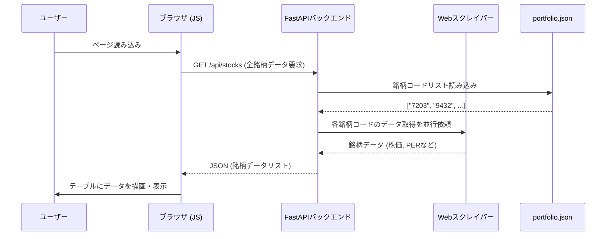
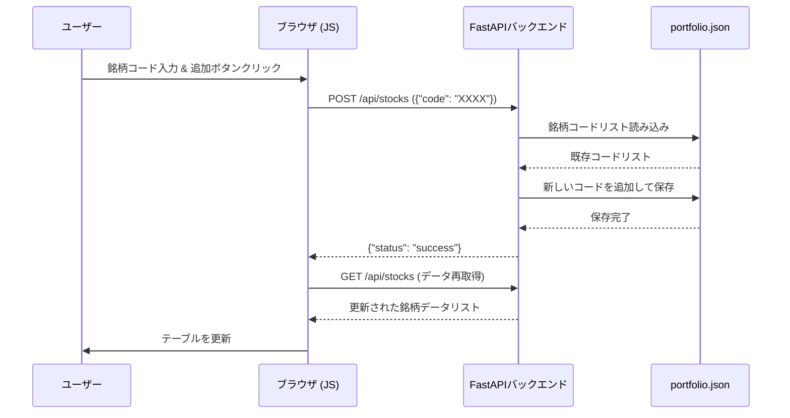
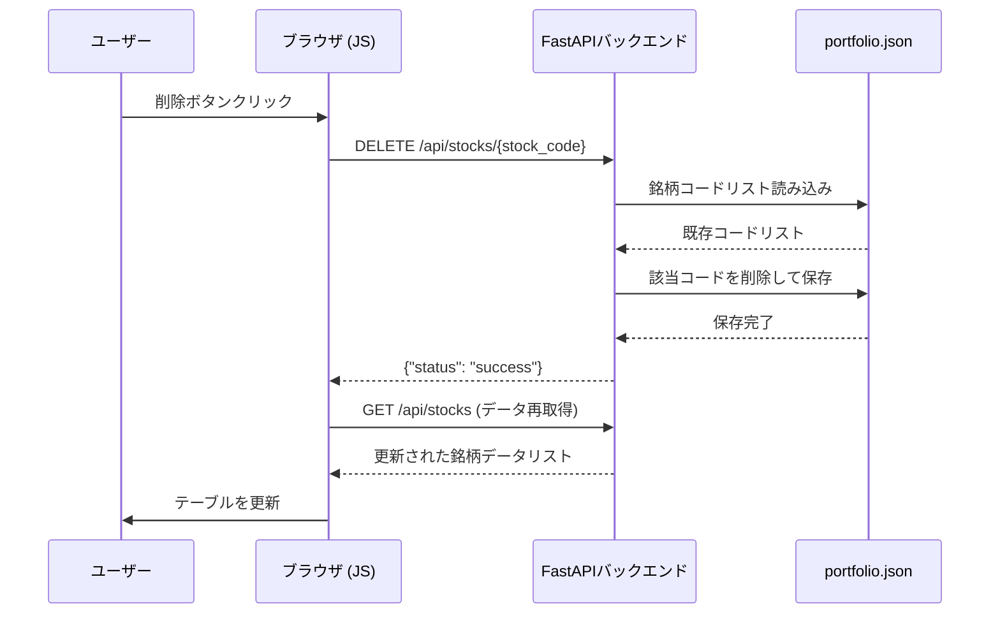

# 国内株式ポートフォリオ管理アプリ (jp-stock-portfolio-app)

## 概要

ユーザーが管理する国内株式の銘柄リストに基づき、株価、財務指標、配当情報をYahoo!ファイナンスから取得し、Webページに一覧表示するシングルページアプリケーション（SPA）です。

主な機能は以下の通りです。
- **銘柄一覧表示**: 登録された銘柄の各種情報をリアルタイムで取得し、テーブル形式で表示します。
- **銘柄追加**: 銘柄コードを指定して、ポートフォリオに新しい銘柄を追加します。
- **銘柄削除**: ポートフォリオから不要な銘柄を削除します。
- **ソート機能**: ポートフォリオ一覧の各項目（銘柄コード、株価など）をクリックすることで、データを昇順・降順に並び替えることができます。

## 主な技術

### バックエンド
- **言語**: Python 3.10+
- **Webフレームワーク**: FastAPI
- **Webサーバー**: Uvicorn
- **データ取得**: `requests` (HTMLからページ埋め込みJSONを抽出)
- **データ永続化**: JSONファイル (`portfolio.json`)

### フロントエンド
- **HTML/CSS**: Jinja2テンプレート
- **JavaScript**: ES6+, Fetch API

## セットアップと実行方法

1. **リポジトリをクローンします。**
   ```bash
   git clone https://github.com/your-username/jp-stock-portfolio-app.git
   cd jp-stock-portfolio-app
   ```

2. **必要なPythonライブラリをインストールします。**
   ```bash
   pip install fastapi uvicorn python-multipart requests jinja2
   ```

3. **FastAPI開発サーバーを起動します。**
   ```bash
   uvicorn app:app --reload
   ```
   `--reload`オプションにより、コードを変更するとサーバーが自動的に再起動します。

4. **ブラウザでアクセスします。**
   Webブラウザを開き、 `http://127.0.0.1:8000` にアクセスしてください。

## 使い方

- **銘柄の追加**: 画面上部の入力フォームに4桁の銘柄コードを入力し、「追加」ボタンをクリックします。
- **銘柄の削除**: 一覧テーブルの各行にある「削除」ボタンをクリックします。
- **データ更新**: ページをリロードすると、全銘柄の最新情報が再取得されます。
- **ソート**: 一覧テーブルのヘッダー（「銘柄コード」や「現在株価」など）をクリックすると、その列のデータで昇順・降順にソートされます。

## 処理フロー

### データ表示フロー


### 銘柄追加フロー


### 銘柄削除フロー


### next step
- UIの改善(リッチにする)
- CSVダウンロードの機能追加
- 銘柄情報取得できなかった場合のフォローアップ。（要検討）